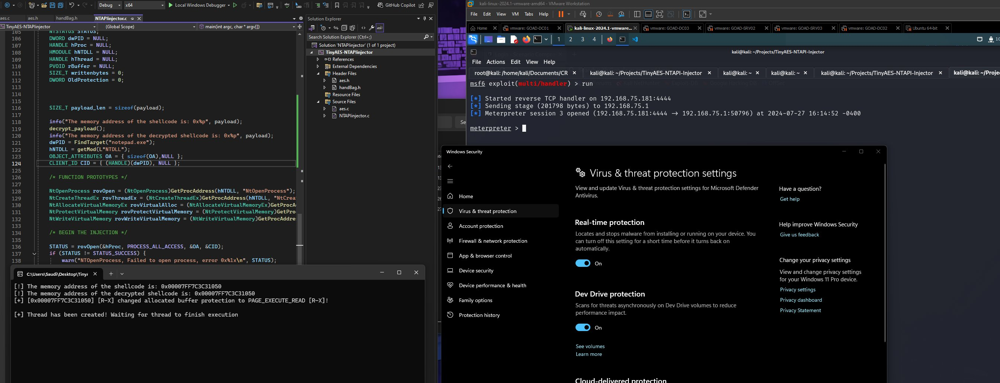

# TinyAES-NTAPI-Injector

- TinyAES is a lightweight library that can be used for encryption operations. In this project, we perform process injection using NTAPIs for low level windows operations for better stealth

## Project Structure

### Source Files
1. `NTAPI-Injector.c` - the main file with the logic for the TinyAES implementation and NTAPI Injection
2. `aes.c` - the main file for TinyAES

### Header Files

3. `aes.h` - header file for TinyAES
4. `handBag.h` - header file containing NTAPI definitions 

